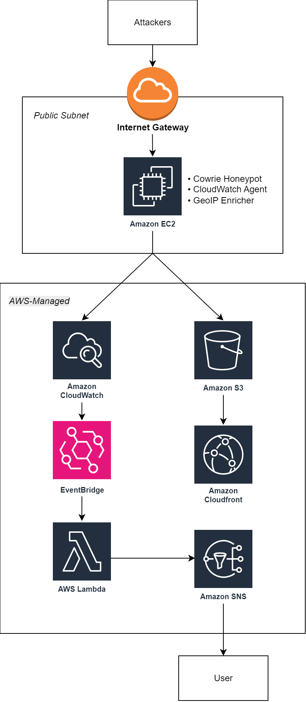
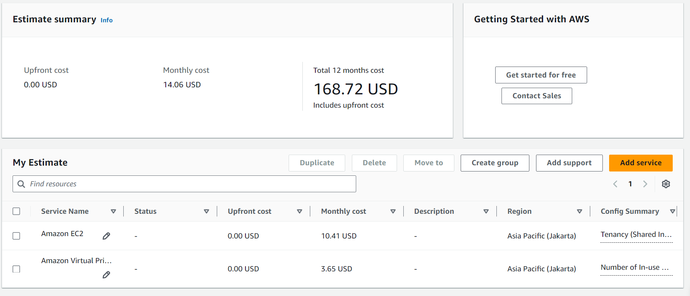
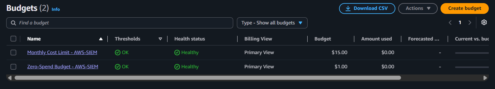
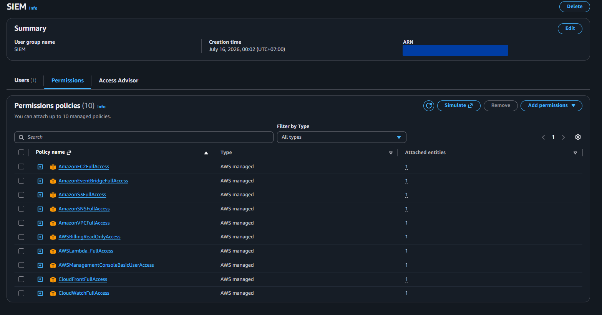
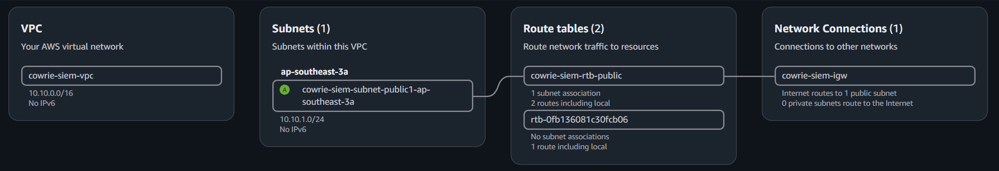
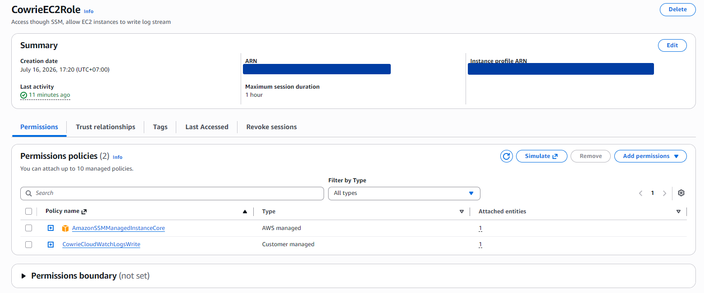
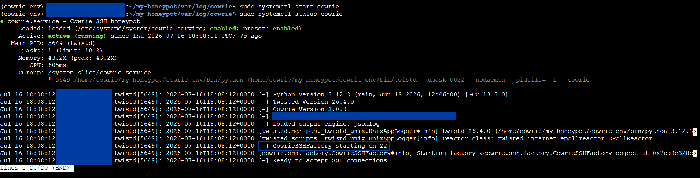
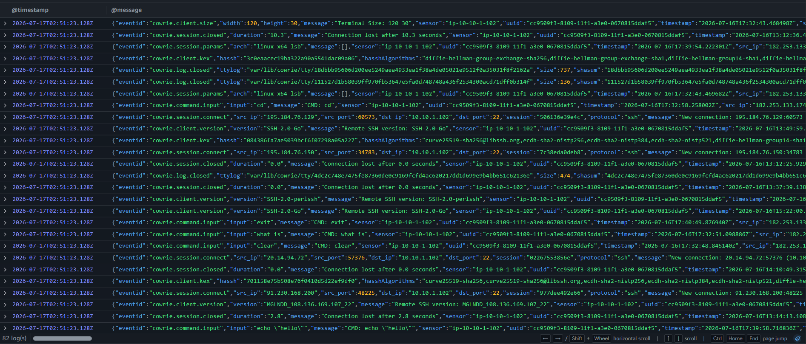

# AWS CloudWatch-Based SIEM with Honeypot

AWS-Hosted Security Information and Event Management (SIEM) using CloudWatch service with Cowrie Honeypot as data source, data and analytics are sanitized and visualized to a public Cloudfront dashboard.

## Architecture Overview

<p align="center">
  
</p>

## Event Flow

1. Internet user connects to the Cowrie honeypot through TCP port 22.
2. Cowrie records auth attempts, commands, sessions, timestamps, etc. activity as JSON events.
3. CloudWatch Agent sends events to CloudWatch Logs.
4. CloudWatch stores and analyzes the logs using Logs Insights queries, metric filters, alarms, and dashboards.
5. Amazon EventBridge routes scheduled detection events & alarm state changes to detector Lambda function.
6. Lambda evaluates the results, generates an alert when suspicious activity is detected.
7. Alerts are delivered to Telegram through the notification pipeline.
8. Raw logs are archived in a private S3 bucket, while sanitized statistics are published through a separate S3 bucket and CloudFront distribution.

## Services

Project uses the following AWS services :

| Services | Use |
| - | - |
| **Amazon EC2** | Hosts the Cowrie honeypot, CloudWatch Agent and GeoLite2 DB |
| **Amazon CloudWatch** | Centralizes logs and provides queries, metrics, alarms, and dashboards |
| **Amazon EventBridge** | Routes scheduled detection events and alarm state changes |
| **Amazon Lambda** | Evaluates detection results and generates concise alerts |
| **Amazon SNS** | Distributes alert notifications |
| **Amazon S3** | Archives raw logs and stores sanitized dashboard data |
| **Amazon Cloudfront** | Publishes the sanitized portfolio dashboard |

# Preparation

## Cowrie

  

Cowrie is a medium- and high-interaction SSH and Telnet honeypot designed to capture brute-force attempts and record attacker activity. In this project, Cowrie operates in medium-interaction shell mode, where it emulates UNIX environment in Python and serves as the primary source of data.

## Region

Regional resources in this project are deployed in the Asia Pacific (Jakarta) Region _(ap-southeast-3)_. CloudFront is a global service, while other resources (EC2, CloudWatch, Lambda, SNS, EventBridge, and S3) are configured in selected AWS Region.

## Pricing Calculation



Estimated Monthly cost is **14.06 USD**. The cost covers one **EC2 Instances + gp3 EBS**, and one **Public IPv4 address**.

**CloudWatch, Lambda, SNS, S3 & CloudFront** will use Free Tier Plan, therefore the services will be free of charge.

## Budgeting



Project service costs per month are tracked via AWS Budgets `Monthly Cost Limit`. Additionally, `Zero-Spend` alert is also configured to flag any unexpected resource usage before it accumulate cost.

## Account

Before starting, a separate IAM user named `bint-siem` is created instead of using the root user account for the project. The user is then attached to a user group with only the permissions necessary for this project, following the _Principle of Least Privilege_ (PoLP) 



# Network

## VPC



EC2 instance is deployed in a _Virtual Private Cloud_ (VPC) named `cowrie-siem-vpc` using `10.10.0.0/16` CIDR block, with a public subnet at `10.10.1.0/24`. This setup provides 251 IP addresses (AWS reserves 5 addresses) which is more than enough for the EC2 instance.

## Security Group

Security group is configured for `cowrie-siem-vpc` with inbound and outbound rules as below:

a. Inbound Rules

| Type | Protocol | Port | Source | Purpose
| - | - | - | - | - |
| SSH | TCP | 22 | `0.0.0.0/0` | Cowrie fake SSH service

b. Outbound Rules

| Type | Protocol | Port | Destination | Purpose
| - | - | - | - | - |
| HTTPS | TCP | 443 | `0.0.0.0/0` | SSM, CloudWatch, AWS APIs, HTTPS package repositories
| HTTP | TCP | 80 | `0.0.0.0/0` | If a package repository still requires HTTP

# EC2

## IAM role



EC2 instance is attached with a role with policies below:

a. `AmazonSSMManagedInstanceCore` : Enable AWS Systems Manager service core 
functionality

b. `CowrieCloudWatchLogsWrite` _(Inline Policy)_ : Send logs only to `/honeypot/cowrie` CloudWatch Logs group

## Installing Cowrie

Before installing Cowrie, a dedicated unprevileged user and python venv are created. Running Cowrie without admin power limits impact if honeypot is compromised, venv keeps python dependencies isolated from the system environment.

After setup, `cowrie 3.0.0` is installed. Configuration is set as below after `cowrie init` is completed:
```
[honeypot]
hostname = srv-test-01
backend = shell

[ssh]
enabled = true
listen_endpoints = tcp:22:interface=0.0.0.0

[telnet]
enabled = false
```
Since ports 1-1023 are reserved for root user, we need to use `CAP_NET_BIND_SERVICE`:
```
# Limits privileges available to Cowrie, so it can only request the power to bind to low ports.
CapabilityBoundingSet=CAP_NET_BIND_SERVICE

# Give the low ports bind privilege to Cowrie 
AmbientCapabilities=CAP_NET_BIND_SERVICE
```

Once configuration is set, give TCP 22 port to cowrie by disabling `ssh.service` and `ssh.socket`, and enabling / starting Cowrie.



Note that SSH is no longer available, EC2 is accessed via AWS Systems Manager (SSM)

## Blocking new outbound connections from Cowrie

After installing and configuring Cowrie in the EC2 instance, connections initiated by Cowrie are blocked using:
```
meta skuid ${COWRIE_UID} ct state new reject
```
This rule is implemented using a script & persisted using systemd.

After implementation, Cowrie cannot initiate outbound connections. It can only respond to attackers who establish an inbound connection.


# CloudWatch

## Log Group

Created `/honeypot/cowrie` log group to receive logs from Cowrie EC2 instance.

## CloudWatch Agent

`AmazonCloudWatchAgent` package is installed to the EC2 instance via SSM &rarr; Run command, using `AWS-ConfigureAWSPackage` document.

CloudWatch agent is configured as below:

Source &rarr; `/log/cowrie/cowrie.json`
Target &rarr; `/honeypot/cowrie`

After configuration, CloudWatch agent successfully sends logs to Cloudwatch Logs.



## Metric Filter & Alarm

Metric filter is configured to detect any successful login events using pattern:

```
{ $.eventid = "cowrie.login.success" }
```

Each matching event adds a value of `1` to the metric. If no matching event is found, the default value is `0`.

The alarm is configured to enter `ALARM` state when the metric value sum is `>=1` within 1 minute.

# SNS

`cowrie-sec-alerts` SNS topic is created to be used for alerting via Telegram.

# Lambda

`cowrie-detector` function is created using configuration as below:

`python 3.14` runtime.
`timeout = 15 seconds` for safety buffer in case of network delays
`env_variable = SNS_TOPIC_ARN`  to avoid hardcoding ARN

Lambda code is available [here](script.py)  