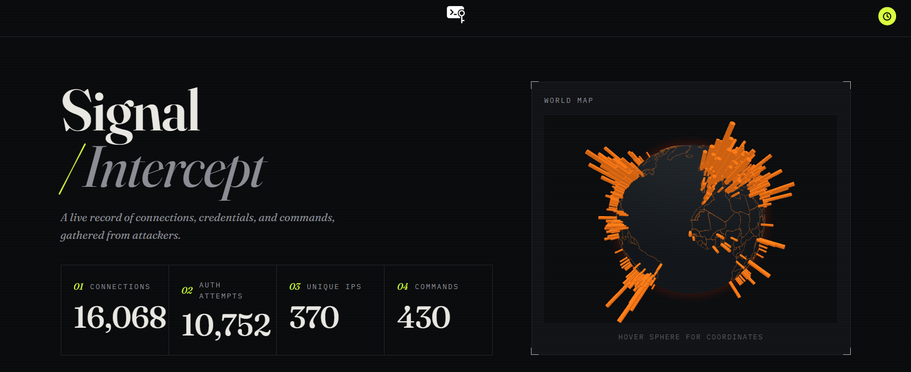
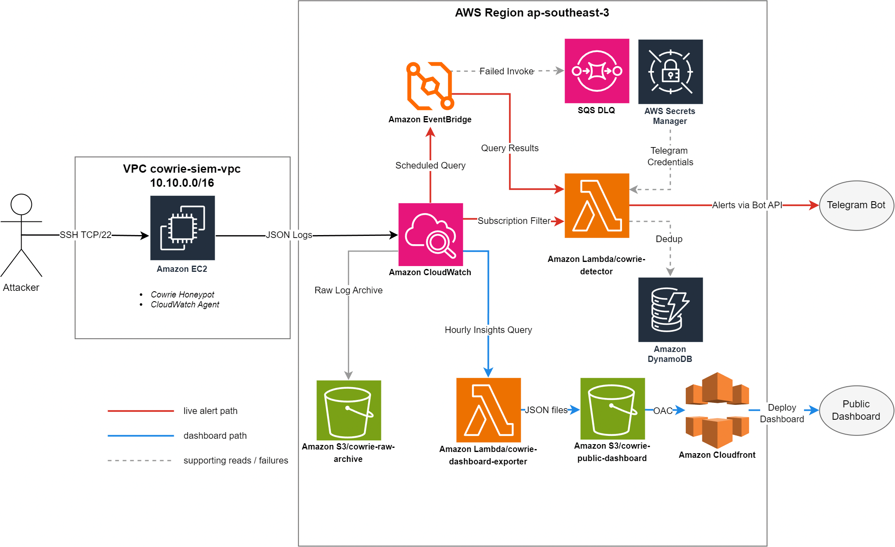
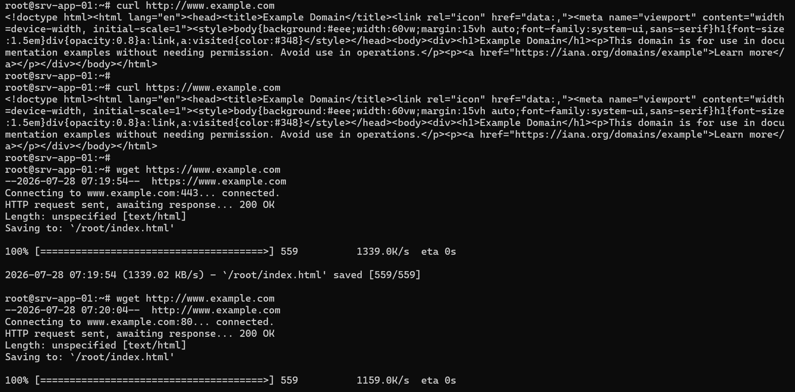
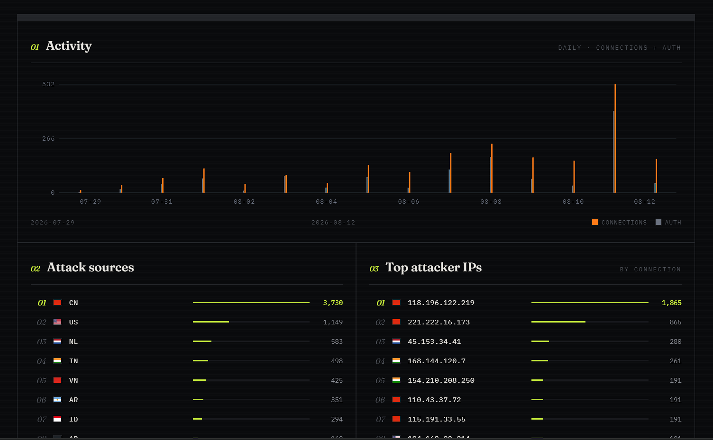

# Signal/Intercept: AWS CloudWatch-Based SIEM with Honeypot & Notifier



AWS-Hosted Security Information and Event Management (SIEM) using CloudWatch service with Cowrie Honeypot as data source, data and analytics are visualized to a public CloudFront dashboard.

Live dashboard @ [cloudfront.net](https://d35xk6zzbitrov.cloudfront.net/)

## Table of Contents

- [Architecture Overview](#architecture-overview)
- [Event Flow](#event-flow)
- [Services](#services)
- [Preparation](#preparation)
  - [Cowrie](#cowrie)
  - [Region](#region)
  - [Pricing Calculation](#pricing-calculation)
  - [Budgeting](#budgeting)
  - [Account](#account)
- [Network](#network)
  - [VPC](#vpc)
  - [Security Group](#security-group)
- [EC2](#ec2)
  - [IAM role](#iam-role)
  - [Installing Cowrie](#installing-cowrie)
  - [Patch Cowrie curl command](#patch-cowrie-curl-command)
  - [Filtering Cowrie outbound connections](#filtering-cowrie-outbound-connections)
- [Detecting the attackers](#detecting-the-attackers)
  - [CloudWatch Log Group](#cloudwatch-log-group)
  - [CloudWatch Agent](#cloudwatch-agent)
  - [Subscription Filter](#subscription-filter)
  - [Scheduled Query with DLQ](#scheduled-query-with-dlq)
  - [Amazon DynamoDB](#amazon-dynamodb)
  - [Telegram](#telegram)
  - [Lambda](#lambda)
  - [EventBridge](#eventbridge)
- [Public Dashboard](#public-dashboard)
  - [How it works](#how-it-works)
  - [Infrastructure](#infrastructure)
- [Results](#results)
- [Conclusion](#conclusion)
  - [Lessons Learned](#lessons-learned)

## Architecture Overview

<p align="center">
  
</p>

## Event Flow

1. Internet user connects to the Cowrie honeypot through TCP port 22.
2. Cowrie records auth attempts, commands, sessions, timestamps, etc. activity as JSON events.
3. CloudWatch Agent sends events to CloudWatch Logs.
4. CloudWatch stores and analyzes the logs using Logs Insights queries and dashboards.
5. A subscription filter streams successful-login and file-transfer events directly to the detector Lambda.
6. Amazon EventBridge routes scheduled-query completion events to the detector Lambda function.
7. Lambda evaluates the results, deduplicates repeated bursts via DynamoDB, and generates an alert when suspicious activity is detected.
8. Alerts are sent directly to Telegram through the Bot API, with source-country flags resolved via ip-api.com.
9. Raw logs are archived in a private S3 bucket, while statistics are published through a separate S3 bucket and CloudFront distribution.

## Services

Project uses the following AWS services :

| Services | Use |
| - | - |
| **Amazon EC2** | Hosts the Cowrie honeypot and CloudWatch Agent |
| **Amazon CloudWatch** | Centralizes logs and provides queries, metrics, alarms, and dashboards |
| **Amazon EventBridge** | Routes scheduled-query completion events to the detector Lambda |
| **Amazon Lambda** | Evaluates detection results and generates alerts |
| **Amazon DynamoDB** | Stores burst-dedup keys with TTL so repeated attackers are not re-alerted |
| **AWS Secrets Manager** | Holds the Telegram bot token and chat ID |
| **Amazon SQS** | Dead-letter queue for failed EventBridge deliveries to Lambda |
| **Amazon S3** | Archives raw logs and stores dashboard data |
| **Amazon CloudFront** | Publishes the portfolio dashboard |

## Preparation

### Cowrie

  

Cowrie is a medium- and high-interaction SSH and Telnet honeypot designed to capture brute-force attempts and record attacker activity. In this project, Cowrie operates in medium-interaction shell mode where it emulates UNIX environment in Python and serves as the primary source of data.

### Region

Regional resources in this project are deployed in the Asia Pacific (Jakarta) Region _(ap-southeast-3)_. CloudFront is a global service, while other resources (EC2, CloudWatch, Lambda, DynamoDB, EventBridge, Secrets Manager, and S3) are configured in selected AWS Region.

### Pricing Calculation


Estimated Monthly cost is **14.06 USD** as of `16 July 2026`. The cost covers one **EC2 Instances + 8GB gp3 EBS**, and one **Public IPv4 address**.

**CloudWatch, Lambda, S3 & CloudFront** will use Free Tier Plan and expected to remain within free tier usage, therefore the services will be free of charge. **DynamoDB** (on-demand, a few items per day) and **Secrets Manager** (one secret) add well under `0.50 USD` per month at honeypot volume.

### Budgeting


Project service costs per month are tracked via AWS Budgets `Monthly Cost Limit`. Additionally, `Zero-Spend` alert is also configured to flag any unexpected resource usage before it accumulates cost.

### Account

Before starting, a separate IAM user named `bint-siem` is created instead of using the root user account for the project. The user is then attached to a user group with only the permissions necessary for this project, following the _Principle of Least Privilege_ (PoLP)


## Network

### VPC


EC2 instance is deployed in a _Virtual Private Cloud_ (VPC) named `cowrie-siem-vpc` using `10.10.0.0/16` CIDR block, with a public subnet at `10.10.1.0/24`. This setup provides 251 IP addresses (AWS reserves 5 addresses) which is more than enough for the EC2 instance.

### Security Group

Security group is configured for `cowrie-siem-vpc` with inbound and outbound rules as below:

a. Inbound Rules

| Type | Protocol | Port | Source | Purpose
| - | - | - | - | - |
| SSH | TCP | 22 | `0.0.0.0/0` | Cowrie fake SSH service

b. Outbound Rules

| Type | Protocol | Port | Destination | Purpose
| - | - | - | - | - |
| HTTPS | TCP | 443 | `0.0.0.0/0` | SSM, CloudWatch, AWS APIs, HTTPS package repositories
| HTTP | TCP | 80 | `0.0.0.0/0` | If a package repository still requires HTTP

## EC2

### IAM role


EC2 instance is attached with a role with policies below:

a. `AmazonSSMManagedInstanceCore`: Enable AWS Systems Manager service core functionality

b. `CowrieCloudWatchLogsWrite` _(Inline Policy)_: Send logs to the `/honeypot/cowrie` log group and publish metrics to the `Cowrie/Host` namespace

### Installing Cowrie

Before installing Cowrie, a dedicated unprivileged user and python venv are created. Running Cowrie without admin power limits impact if honeypot is compromised, venv keeps python dependencies isolated from the system environment.

After setup, `cowrie 3.0.0` is installed. Configuration is set as below after `cowrie init` is completed:

```
[honeypot]
hostname = srv-test-01
backend = shell
download_limit_size = 10485760

[ssh]
enabled = true
listen_endpoints = tcp:22:interface=0.0.0.0

[telnet]
enabled = false
```

Since ports 1-1023 normally requires root privileges, `CAP_NET_BIND_SERVICE` is used:

```
# Restrict the service's available capabilities
CapabilityBoundingSet=CAP_NET_BIND_SERVICE

# Grant the capability required to bind to TCP port 22
AmbientCapabilities=CAP_NET_BIND_SERVICE
```

Once configuration is set, give TCP 22 port to cowrie by disabling `ssh.service` and `ssh.socket`, and enabling / starting Cowrie.


Note that SSH is no longer available, EC2 is accessed via AWS Systems Manager (SSM)

### Patch Cowrie curl command

`Cowrie 3.0.0` contains a bug in its emulated curl command.

```
src/cowrie/commands/curl.py  
```

When downloading from web servers that do not return a `Content-Length` header, Twisted sets `response.length` to the string sentinel `UNKNOWN_LENGTH`. Cowrie attempts to evaluate `self.totallength > limit_size`, raising `TypeError: '>' not supported between instances of 'str' and 'int'` and crashing the transfer silently.

The fix is to make `self.totallength` comparisons int-safe. The byte-level size limit in `collect()` remains fully enforced during transfer:

```python

# Before
if limit_size > 0 and self.totallength > limit_size:

# After
if limit_size > 0 and isinstance(self.totallength, int) and self.totallength > limit_size:  

```

### Filtering Cowrie outbound connections

After installing and configuring Cowrie on the EC2 instance, outbound traffic from `cowrie` user allows public HTTP (80) and HTTPS (443) payload retrieval, restrict DNS to local/VPC resolvers, and reject unsafe destinations (private IPs, EC2 metadata, IPv6).

```nftables

meta skuid ${COWRIE_UID} ip daddr { 127.0.0.53, 127.0.0.1, 10.10.0.2 } udp dport 53 accept
meta skuid ${COWRIE_UID} ip daddr { 127.0.0.53, 127.0.0.1, 10.10.0.2 } tcp dport 53 accept

meta skuid ${COWRIE_UID} ip daddr @unsafe_ipv4 ct state new \
  log prefix "cowrie-egress-unsafe " counter reject
meta skuid ${COWRIE_UID} ip6 daddr ::/0 ct state new \
  log prefix "cowrie-egress-ipv6 " counter reject

meta skuid ${COWRIE_UID} tcp dport { 80, 443 } accept

meta skuid ${COWRIE_UID} ct state new \
  log prefix "cowrie-egress-deny " counter reject

```

This rule is implemented using a custom script and persisted using systemd

After implementation, Cowrie can resolve names and fetch files over HTTP/HTTPS to capture downloads via `wget`/`curl`, but it cannot reach AWS metadata (`169.254.169.254`), private internal networks, IPv6, or non-HTTP ports.



>The VPC is IPv4-only today, so the IPv6 rule matches no traffic. However, because the firewall uses the `inet` family, any future IPv6 traffic would bypass the IPv4-only deny list, leaving egress unrestricted.

## Detecting the attackers

### CloudWatch Log Group

Created `/honeypot/cowrie` log group to receive logs from Cowrie EC2 instance.

### CloudWatch Agent

`AmazonCloudWatchAgent` package is installed to the EC2 instance via SSM &rarr; Run command, using `AWS-ConfigureAWSPackage` document.

CloudWatch agent is configured as below:

Source &rarr; `/home/cowrie/my-honeypot/var/log/cowrie/cowrie.json`
Target &rarr; `/honeypot/cowrie`

After configuration, CloudWatch agent successfully sends logs to CloudWatch Logs.


### Subscription Filter

CloudWatch Logs subscription filter streams successful login, and file transfer events directly to the detector Lambda.

Subscription filter named `cowrie-high-confidence-events` is configured on the `/honeypot/cowrie` log group with the pattern:

```pattern

{ ($.eventid = "cowrie.login.success") || ($.eventid = "cowrie.session.file_upload") || ($.eventid = "cowrie.session.file_download") }

```

| Setting | Value |
|---|---|
| Filter name | `cowrie-high-confidence-events` |
| Destination | Lambda function `cowrie-detector` |
| Log format | JSON |

CloudWatch Logs sends compressed events to Lambda. Lambda decodes and verifies the payload, maps the event to a detection type, and sends a Telegram alert with key details (detection name, severity, country flag, source IP, timestamp, sensor alias, alert ID, event-specific fields such as credentials, filename or URL, and optional SHA-256).

| Cowrie event | Detection | Severity |
|---|---|---|
| `cowrie.login.success` | `COWRIE_EMULATED_AUTH_ACCEPTED` | HIGH |
| `cowrie.session.file_upload` | `COWRIE_FILE_UPLOADED` | HIGH |
| `cowrie.session.file_download` | `COWRIE_URL_PAYLOAD_DOWNLOADED` | HIGH |

### Scheduled Query with DLQ

CloudWatch's scheduled query is created to detect login attempts, using filter as below:

  ```

  fields "CREDENTIAL_GUESSING_BURST" as detection,
        src_ip,
        username,
        session
  | filter eventid = "cowrie.login.failed"
      or eventid = "cowrie.login.success"
  | stats count(*) as attempts,
          count_distinct(username) as usernames,
          count_distinct(session) as sessions
    by detection, src_ip
  | filter attempts >= 5
  | sort attempts desc
  
  ```

The query is run every 5 minutes indefinitely, with lookback of 20 minutes.

Because logs take a few minutes to process and become searchable, this 20-minute window ensures late-arriving events are not missed. This overlap means the system may read the same event up to four times, but duplicate events are filtered out by a DynamoDB deduplication table (_see Amazon DynamoDB below_).

`cowrie-detector-dlq` is attached for when EventBridge can't successfully invoke the Lambda, CloudWatch alarm is assigned to detect if there's any event in the queue.

### Amazon DynamoDB

Table `cowrie-alert-dedup` (on-demand) deduplicates credential-guessing alerts caused by the query's overlapping lookback windows.

| Setting | Value |
|---|---|
| Table name | `cowrie-alert-dedup` |
| Partition key | `alert_key`  |
| Billing | On-demand |
| TTL | Enabled on `expires_at` |

After sending an alert, the detector writes each alerted `src_ip` with `expires_at` set 25 minutes ahead (longer than query's 20-minute lookback), so each attacker is alerted once and only new IPs appear in later alerts. DynamoDB TTL deletes expired keys lazily, so the detector also compares `expires_at` against the current time before treating an item as fresh.

### Telegram

Alerts are delivered to Telegram directly from the detector Lambda through the Bot API.

Bot is created through `@BotFather` which issues the bot token, and private chat ID is read from `getUpdates`. Both values are stored in Secrets Manager secret `cowrie/telegram` as JSON:

```json
{ "bot_token": "...", "chat_id": "..." }
```

The detector reads the secret at cold start (env var `TELEGRAM_SECRET` holds the secret ID) and sends alerts with `sendMessage`.

### Lambda

`cowrie-detector` function is created using configuration as below:

`python 3.14` runtime.
`timeout = 30 seconds`
`env_variable = TELEGRAM_SECRET` secret ID holding bot token and chat ID
`env_variable = DEDUP_TABLE` DynamoDB table for burst deduplication
`env_variable = COWRIE_LOG_GROUP` to validate the source log group
`env_variable = EXPECTED_ACCOUNT_ID` to reject events from other accounts
`env_variable = EXPECTED_REGION` to reject events from other Regions
`env_variable = CREDENTIAL_QUERY_ARN` to accept only the credential-guessing scheduled query

Lambda code is available at [`code/lambda.py`](code/lambda.py)

### EventBridge

Rule `cowrie-scheduled-queries-to-detector` is created to send the credential-guessing query's completion events to the `cowrie-detector` Lambda.

Successful-login and file-transfer events skip EventBridge, instead the subscription filter delivers those directly to Lambda, so EventBridge carries only the aggregate detection.

The rule matches only this query:

```json
{
  "source": ["aws.logs"],
  "detail-type": ["Scheduled Query Completed"],
  "resources": ["arn:aws:logs:ap-southeast-3:ACCOUNT_ID:scheduled-query:SCHEDULED_QUERY_ID"],
  "detail": { "status": ["Complete"] }
}
```

Each event carries a `queryId`, which Lambda uses to fetch result rows. The target also has the `cowrie-detector-dlq` queue attached, so failed invocations are preserved instead of dropped.

## Public Dashboard

A public, read-only attack dashboard is published through a private S3 bucket fronted by CloudFront (Origin Access Control). It shows attacker source IPs, usernames, passwords, commands, file uploads, and download urls.



### How it works

Hourly EventBridge schedule invokes the `cowrie-dashboard-exporter` Lambda ([`code/exporter.py`](code/exporter.py)), which runs CloudWatch Logs Insights queries over the last 24 hours against `/honeypot/cowrie`, geolocates source IPs with `ip-api.com`, aggregates the results, and writes three JSON documents to the bucket:

| Object | Contents | Purpose |
|---|---|---|
| `meta.json` | `first_data_date`, `generated_at` | Bounds the range picker |
| `live.json` | Rich last-24 h view (globe points, top lists, recent attacks) | Last 24h view |
| `archive.json` | Compact per-day aggregates, all-time | All / 7d / 30d / custom views |

Because the archive is maintained incrementally one day-bucket per run, query cost stays flat regardless of how much history accumulates.

### Infrastructure

Provisioning is scripted in [`code/infra.ps1`](code/infra.ps1), a powershell script that automatically creates or updates every resource for the dashboard in one run:

| Resource | Purpose |
|---|---|
| S3 bucket (dashboard site) | Hosts static dashboard files and JSON exports, Block Public Access enabled |
| S3 bucket (raw archive) | Versioned private bucket storing every raw Cowrie event |
| IAM roles | Least-privilege roles for both Lambdas |
| cowrie-dashboard-exporter Lambda | Packages and deploys [`code/exporter.py`](code/exporter.py) |
| cowrie-raw-archiver Lambda | Packages and deploys [`code/raw_archiver.py`](code/raw_archiver.py) |
| SQS DLQ | Catches failed exporter invocations |
| EventBridge rule | Invokes the exporter hourly |
| Subscription filter | Streams raw Cowrie events to the archiver Lambda |
| CloudFront + OAC | Serves the site publicly via HTTPS |


## Results

Numbers below are taken from the dashboard data, covering the first 15 days (_2026-07-29 &rarr; 2026-08-12_):

| Metric | Value |
|---|---|
| Honeypot connections | 2,123 |
| Authentication attempts | 1,193 |
| Unique source IPs | 293 |
| Commands entered in the fake shell | 276 |
| Payload downloads | 8 |
| File uploads | 9 |


## Conclusion

Project delivers a working SIEM pipeline. Cowrie feeds CloudWatch Logs, a subscription filter alerts on high-confidence events within seconds, a scheduled query catches credential-guessing bursts, and both feed one Lambda that notifies Telegram. In 15 days the honeypot saw 2,123 connections from 293 unique IPs and delivered all 17 file-transfer alerts, at an estimated `14.06 USD` per month.

### Lessons Learned

- Metric alarms were replaced by a subscription filter, since threshold alarms fire late and carry no event detail, while the filter delivers raw events to Lambda in seconds.
- Overlapping lookback windows re-read events, so DynamoDB TTL dedup is set up to handle this, DLQs keep failed invocations from being dropped.
- `Cowrie 3.0.0` emulated curl crashed on real attacker traffic when a download server omitted `Content-Length`, manual debugging and fix were required