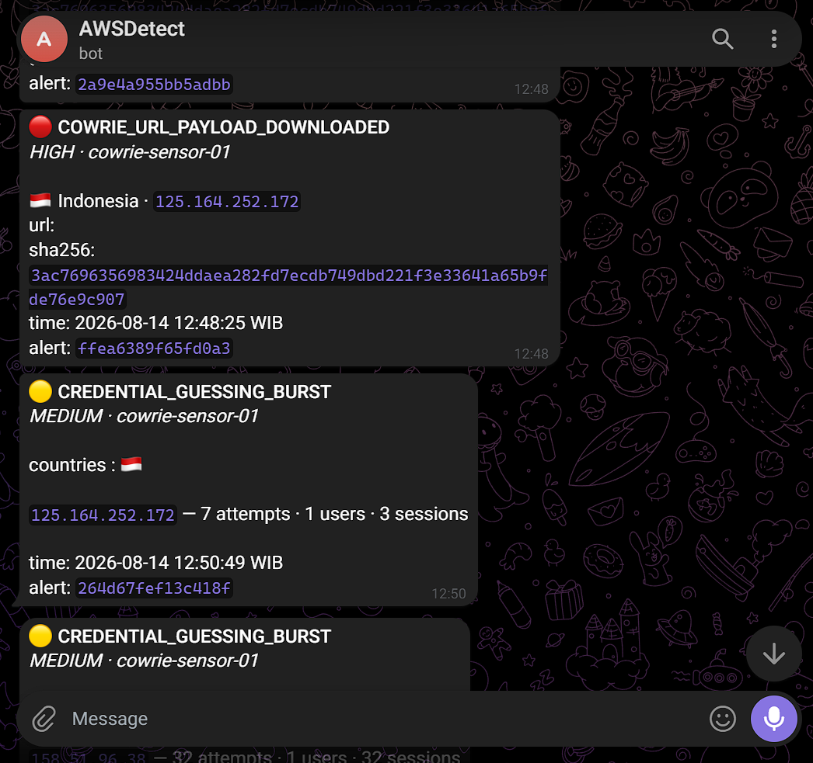

# Technical Writeup: AWS CloudWatch-Based SIEM with Honeypot & Real-Time Alerting

> **Signal / Intercept Project Documentation**  
> For the executive summary and portfolio overview, see the [Portfolio README](./README.md).  
> Live threat dashboard available at: [cloudfront.net](https://d35xk6zzbitrov.cloudfront.net/)

---

## Table of Contents

1. [Architecture Overview](#architecture-overview)
2. [Event Flow](#event-flow)
3. [AWS Services Breakdown](#aws-services-breakdown)
4. [Preparation & Cost Engineering](#preparation--cost-engineering)
   - [Cowrie Honeypot](#cowrie-honeypot)
   - [Region Selection](#region-selection)
   - [Cost Calculation](#cost-calculation)
   - [Budgeting & Cost Guardrails](#budgeting--cost-guardrails)
   - [IAM Account Setup](#iam-account-setup)
5. [Network Engineering](#network-engineering)
   - [VPC Architecture](#vpc-architecture)
   - [Security Group Rules](#security-group-rules)
6. [Honeypot Host & Sensor Hardening](#honeypot-host--sensor-hardening)
   - [IAM Role for EC2](#iam-role-for-ec2)
   - [Installing Cowrie](#installing-cowrie)
   - [Binding Port 22 Without Root Privileges](#binding-port-22-without-root-privileges)
   - [Patching Upstream Cowrie Curl Bug](#patching-upstream-cowrie-curl-bug)
   - [Egress Traffic Containment with nftables](#egress-traffic-containment-with-nftables)
7. [Detection Engineering & Alerting Pipeline](#detection-engineering--alerting-pipeline)
   - [CloudWatch Log Group](#cloudwatch-log-group)
   - [CloudWatch Agent Deployment](#cloudwatch-agent-deployment)
   - [Real-Time Alerts with Subscription Filters](#real-time-alerts-with-subscription-filters)
   - [Scheduled Queries for Credential Guessing & DLQ](#scheduled-queries-for-credential-guessing--dlq)
   - [Burst Deduplication with Amazon DynamoDB](#burst-deduplication-with-amazon-dynamodb)
   - [Telegram Bot Notification Pipeline](#telegram-bot-notification-pipeline)
   - [Detector Lambda Implementation](#detector-lambda-implementation)
   - [EventBridge Scheduling & Routing](#eventbridge-scheduling--routing)
8. [Public Threat Intelligence Dashboard](#public-threat-intelligence-dashboard)
   - [How the Pipeline Works](#how-the-pipeline-works)
   - [Export Data Structures](#export-data-structures)
   - [Infrastructure Automation](#infrastructure-automation)
9. [Operational Results & Threat Telemetry](#operational-results--threat-telemetry)
10. [Engineering Retrospective & Lessons Learned](#engineering-retrospective--lessons-learned)

---

## Architecture Overview

The system captures, analyzes, alerts, and visualizes live cyber attacks using a completely serverless detection pipeline backed by a hardened honeypot sensor on AWS.

<p align="center">
  
</p>

---

## Event Flow

1. **Ingress**: An internet user connects to the Cowrie honeypot through TCP port 22.
2. **Telemetry Capture**: Cowrie emulates an authentic UNIX shell in Python, recording authentication attempts, executed commands, interactive terminal sessions, file transfers, and timestamps as structured JSON events.
3. **Log Shipping**: The unified CloudWatch Agent on EC2 streams raw JSON events directly to CloudWatch Logs group `/honeypot/cowrie`.
4. **Log Analytics**: CloudWatch centralizes and indexes the log stream, providing Logs Insights query capability and metric generation.
5. **Real-Time Push Stream**: A CloudWatch Logs subscription filter evaluates events in real time. Successful logins and file transfer events bypass batch queries and stream directly to the detector Lambda within milliseconds.
6. **Aggregate Pull Stream**: Amazon EventBridge triggers scheduled CloudWatch Logs Insights queries every 5 minutes (with a 20-minute lookback window) to detect credential guessing bursts across multiple attempts.
7. **Deduplication & Evaluation**: The detector Lambda parses incoming events. For batch queries, it checks DynamoDB with a TTL-backed deduplication key to make sure repeated attack bursts from the same IP do not trigger redundant alerts.
8. **Notification**: High-confidence alerts are formatted with attack metadata, source IP geolocation flags from ip-api.com, and sent directly to Telegram through the Bot API.
9. **Archival & Public Visualization**: Raw log events are permanently archived in a private S3 bucket. An hourly aggregation Lambda generates optimized JSON feeds (`meta.json`, `live.json`, `archive.json`) to a public S3 bucket served through Amazon CloudFront with Origin Access Control (OAC).

---

## AWS Services Breakdown

| Service | Role in Pipeline |
| :--- | :--- |
| **Amazon EC2** | Hosts the Cowrie honeypot sensor and the CloudWatch Agent |
| **Amazon CloudWatch** | Centralizes raw JSON logs, runs Logs Insights queries, tracks alarms, and hosts metrics |
| **Amazon EventBridge** | Schedules Log Insights queries and invokes Lambda on query completion |
| **AWS Lambda** | Runs serverless detection logic, deduplication checks, Telegram alerts, and dashboard exports |
| **Amazon DynamoDB** | Fast key-value store managing attacker IP deduplication keys with automatic TTL expiration |
| **AWS Secrets Manager** | Securely stores and rotates Telegram bot tokens and private chat identifiers |
| **Amazon SQS** | Acts as a Dead-Letter Queue (DLQ) to preserve failed EventBridge deliveries and Lambda invocations |
| **Amazon S3** | Stores immutable raw log archives and hosts static JSON exports for the public dashboard |
| **Amazon CloudFront** | Global CDN serving the public threat intelligence dashboard over HTTPS with Origin Access Control |

---

## Preparation & Cost Engineering

### Cowrie Honeypot

<p align="center">
  
</p>

Cowrie is an open-source medium- and high-interaction SSH and Telnet honeypot. It is specifically built to log brute-force attacks and shell interaction performed by adversaries. In this implementation, Cowrie runs in medium-interaction shell mode where it presents a simulated UNIX environment written in Python. This isolates the host operating system while letting attackers attempt interactive commands.

### Region Selection

All regional resources are hosted in the **Asia Pacific (Jakarta) Region (`ap-southeast-3`)**:
- EC2 Honeypot instance
- CloudWatch Log Group and Scheduled Queries
- Lambda Functions (Detector, Exporter, Raw Archiver)
- DynamoDB Deduplication Table
- S3 Buckets (Raw Log Archive and Dashboard Data)
- Secrets Manager Secret
- SQS Dead-Letter Queues

Amazon CloudFront operates globally at AWS edge locations.

### Cost Calculation

<p align="center">
  
</p>

The baseline operating cost for this project is approximately **$14.06 USD per month** (calculated as of July 2026). The primary cost drivers are:
- One `t3.nano` or `t4g.nano` / `t3.micro` EC2 instance + 8 GB gp3 EBS volume.
- One allocated public IPv4 address ($0.005/hour, roughly $3.60/month).
- Serverless components (CloudWatch, Lambda, S3, CloudFront, DynamoDB, Secrets Manager) remain inside AWS Free Tier limits or cost less than $0.50 per month combined due to efficient batching and TTL pruning.

### Budgeting & Cost Guardrails

<p align="center">
  
</p>

To guarantee the project stays within expected cost boundaries:
- An **AWS Budgets Monthly Cost Limit** tracks spending and triggers email alerts at 85% and 100% thresholds.
- A **Zero-Spend Alert** immediately flags unintended resource provisioning (such as unattached EBS volumes or stray NAT gateways) before charges accumulate.

### IAM Account Setup

Following the Principle of Least Privilege (PoLP), the AWS root account is never used for operations. A dedicated IAM user named `bint-siem` was created and assigned to a custom group containing only the specific permissions needed for this infrastructure.

<p align="center">
  
</p>

---

## Network Engineering

### VPC Architecture

The honeypot runs in an isolated Virtual Private Cloud (VPC) named `cowrie-siem-vpc`.

<p align="center">
  
</p>

- **IPv4 CIDR Block**: `10.10.0.0/16`
- **Public Subnet**: `10.10.1.0/24` (251 usable IP addresses after AWS reserves 5)
- **Internet Gateway**: Attached to provide public routability for attacker ingress on port 22 and outbound telemetry shipping.

### Security Group Rules

The security group restricts ingress strictly to the honeypot port and allows only essential outbound channels:

**Inbound Rules:**

| Type | Protocol | Port Range | Source | Description / Purpose |
| :--- | :--- | :--- | :--- | :--- |
| SSH | TCP | 22 | `0.0.0.0/0` | Directs public attacker traffic into the Cowrie honeypot |

**Outbound Rules:**

| Type | Protocol | Port Range | Destination | Description / Purpose |
| :--- | :--- | :--- | :--- | :--- |
| HTTPS | TCP | 443 | `0.0.0.0/0` | AWS Systems Manager (SSM), CloudWatch Logs API, package updates |
| HTTP | TCP | 80 | `0.0.0.0/0` | Package repository fallbacks and monitored honeypot payload downloads |

---

## Honeypot Host & Sensor Hardening

### IAM Role for EC2

<p align="center">
  
</p>

The EC2 instance uses an attached IAM Instance Profile with two targeted policies:
1. `AmazonSSMManagedInstanceCore`: Enables AWS Systems Manager Session Manager, allowing shell access without any open inbound management ports.
2. `CowrieCloudWatchLogsWrite` (Inline Policy): Grants write-only access to `/honeypot/cowrie` log group and the `Cowrie/Host` custom metrics namespace.

### Installing Cowrie

Cowrie is installed under a dedicated unprivileged user account (`cowrie`) inside an isolated Python virtual environment. This limits the blast radius if an attacker manages to exploit the honeypot daemon.

Configuration settings in `cowrie.cfg`:

```ini
[honeypot]
hostname = srv-test-01
backend = shell
download_limit_size = 10485760

[ssh]
enabled = true
listen_endpoints = tcp:22:interface=0.0.0.0

[telnet]
enabled = false
```

### Binding Port 22 Without Root Privileges

Linux restricts ports below 1024 to root privileges. Rather than running Cowrie as root or setting up port redirection through iptables NAT, Linux file capabilities are granted via the systemd service definition:

```ini
# Restrict the service's available capabilities
CapabilityBoundingSet=CAP_NET_BIND_SERVICE

# Grant the capability required to bind to TCP port 22 directly
AmbientCapabilities=CAP_NET_BIND_SERVICE
```

The host default SSH service is completely disabled:

```bash
sudo systemctl stop ssh.socket ssh.service
sudo systemctl disable ssh.socket ssh.service
sudo systemctl enable --now cowrie.service
```

<p align="center">
  
</p>

Since the host SSH service is disabled, administrative access to the EC2 instance is handled exclusively through AWS Systems Manager (SSM) Session Manager.

### Patching Upstream Cowrie Curl Bug

During live testing, incoming attacker traffic exposed an unhandled exception in Cowrie 3.0.0's emulated `curl` command (`src/cowrie/commands/curl.py`).

When an attacker attempted to download payloads from servers that omit the `Content-Length` HTTP header, Twisted assigned `response.length` to the string sentinel value `UNKNOWN_LENGTH`. Cowrie then evaluated `self.totallength > limit_size`, raising:

```text
TypeError: '>' not supported between instances of 'str' and 'int'
```

This error silently aborted payload capture. The issue was solved by introducing a type check on `self.totallength` before performing the comparison, ensuring full safety while preserving the byte-level download limit:

```python
# Before
if limit_size > 0 and self.totallength > limit_size:

# After (patched)
if limit_size > 0 and isinstance(self.totallength, int) and self.totallength > limit_size:
```

### Egress Traffic Containment with nftables

Honeypots must never become launchpads for outbound attacks, lateral movement, or AWS credential theft. A strict egress filtering policy was implemented using `nftables`:

```nftables
# Allow DNS lookups through trusted local and VPC resolvers
meta skuid ${COWRIE_UID} ip daddr { 127.0.0.53, 127.0.0.1, 10.10.0.2 } udp dport 53 accept
meta skuid ${COWRIE_UID} ip daddr { 127.0.0.53, 127.0.0.1, 10.10.0.2 } tcp dport 53 accept

# Reject access to internal subnets and AWS metadata service (169.254.169.254)
meta skuid ${COWRIE_UID} ip daddr @unsafe_ipv4 ct state new \
  log prefix "cowrie-egress-unsafe " counter reject
meta skuid ${COWRIE_UID} ip6 daddr ::/0 ct state new \
  log prefix "cowrie-egress-ipv6 " counter reject

# Allow outbound HTTP and HTTPS so wget/curl can fetch attacker payloads
meta skuid ${COWRIE_UID} tcp dport { 80, 443 } accept

# Deny all remaining outbound traffic from the honeypot user
meta skuid ${COWRIE_UID} ct state new \
  log prefix "cowrie-egress-deny " counter reject
```

This configuration:
- Allows payload capture tools (`wget`, `curl`) to pull malware binaries over ports 80 and 443 for analysis.
- Completely blocks access to the AWS Instance Metadata Service (`169.254.169.254`), neutralizing Server-Side Request Forgery (SSRF) and credential theft attempts.
- Prohibits lateral scans against internal VPC addresses (`10.10.0.0/16`) and private RFC1918 subnets.
- Rejects IPv6 traffic so it cannot be used to bypass the IPv4 security boundaries.

<p align="center">
  
</p>

---

## Detection Engineering & Alerting Pipeline

### CloudWatch Log Group

The log group `/honeypot/cowrie` receives all structured events from the sensor with standard CloudWatch retention policies.

### CloudWatch Agent Deployment

The unified CloudWatch Agent was installed on the EC2 instance via AWS Systems Manager Run Command using the `AWS-ConfigureAWSPackage` document.

Configuration file mapping:
- **Log Source**: `/home/cowrie/my-honeypot/var/log/cowrie/cowrie.json`
- **Destination**: `/honeypot/cowrie`
- **Format**: JSON

<p align="center">
  
</p>

### Real-Time Alerts with Subscription Filters

To minimize alerting latency, high-confidence security events bypass scheduled batch queries. A CloudWatch Logs subscription filter named `cowrie-high-confidence-events` monitors `/honeypot/cowrie`:

```text
{ ($.eventid = "cowrie.login.success") || ($.eventid = "cowrie.session.file_upload") || ($.eventid = "cowrie.session.file_download") }
```

When an event matches this pattern, CloudWatch compresses and pushes the log batch directly to the `cowrie-detector` Lambda function. Alerts reach Telegram in less than three seconds.

| Cowrie Event ID | Mapped Detection Name | Severity Level |
| :--- | :--- | :--- |
| `cowrie.login.success` | `COWRIE_EMULATED_AUTH_ACCEPTED` | HIGH |
| `cowrie.session.file_upload` | `COWRIE_FILE_UPLOADED` | HIGH |
| `cowrie.session.file_download` | `COWRIE_URL_PAYLOAD_DOWNLOADED` | HIGH |

### Scheduled Queries for Credential Guessing & DLQ

Brute-force attacks generate high volumes of failed login attempts. To detect these without overloading Lambda with single-event notifications, a CloudWatch Logs Insights scheduled query runs every 5 minutes:

```text
fields "CREDENTIAL_GUESSING_BURST" as detection,
       src_ip,
       username,
       session
| filter eventid = "cowrie.login.failed"
    or eventid = "cowrie.login.success"
| stats count(*) as attempts,
        count_distinct(username) as usernames,
        count_distinct(session) as sessions
  by detection, src_ip
| filter attempts >= 5
| sort attempts desc
```

**Query Lookback Window**: The query scans a 20-minute lookback window. Because CloudWatch Logs indexing can take between 1 and 3 minutes during heavy load, this 20-minute window guarantees that delayed events are never missed.

**Dead-Letter Queue (DLQ)**: An Amazon SQS queue named `cowrie-detector-dlq` catches any failed invocations or throttling exceptions from EventBridge to Lambda. A CloudWatch alarm monitors `ApproximateNumberOfMessagesVisible` to notify administrators of delivery issues.

### Burst Deduplication with Amazon DynamoDB

Because the 20-minute query window overlaps across 5-minute schedule runs, a single ongoing attack burst could be queried up to four times. To prevent alert spam, the detector Lambda uses an on-demand DynamoDB table named `cowrie-alert-dedup`:

| Setting | Configuration Value |
| :--- | :--- |
| **Table Name** | `cowrie-alert-dedup` |
| **Partition Key** | `alert_key` (String, format: `BURST#<src_ip>`) |
| **Billing Mode** | On-demand (Pay per request) |
| **Time to Live (TTL)** | Enabled on attribute `expires_at` |

When an alert is sent, the detector records `alert_key` with `expires_at` set to 25 minutes into the future (longer than the 20-minute query lookback). Subsequent query executions check this key: if it exists and is still valid, the alert is suppressed.

### Telegram Bot Notification Pipeline

Alerts are sent to a private Telegram channel via the Telegram Bot API (`sendMessage` endpoint):
- Bot created using `@BotFather`.
- Bot credentials and chat identifiers stored in AWS Secrets Manager under `cowrie/telegram`:

```json
{
  "bot_token": "YOUR_TELEGRAM_BOT_TOKEN",
  "chat_id": "YOUR_TELEGRAM_CHAT_ID"
}
```

The detector Lambda fetches this secret during initialization (cold start) and caches it in memory for subsequent warm invocations.

<p align="center">
  
</p>

### Detector Lambda Implementation

The function [`code/lambda.py`](code/lambda.py) runs on Python 3.14 with a 30-second timeout. It validates incoming payloads against environment variables:
- `TELEGRAM_SECRET`: Secret name or inline JSON configuration.
- `DEDUP_TABLE`: Target DynamoDB deduplication table name.
- `COWRIE_LOG_GROUP`: Expected source log group (`/honeypot/cowrie`).
- `EXPECTED_ACCOUNT_ID`: Discards events originating from unexpected accounts.
- `EXPECTED_REGION`: Discards events originating from other AWS regions.
- `CREDENTIAL_QUERY_ARN`: Ensures only authorized scheduled queries trigger processing.
- `GEOIP_ENABLED`: Resolves source IP country flags via `ip-api.com`.

### EventBridge Scheduling & Routing

An EventBridge rule named `cowrie-scheduled-queries-to-detector` watches for completed query events and routes them to the detector:

```json
{
  "source": ["aws.logs"],
  "detail-type": ["Scheduled Query Completed"],
  "resources": ["arn:aws:logs:ap-southeast-3:ACCOUNT_ID:scheduled-query:SCHEDULED_QUERY_ID"],
  "detail": {
    "status": ["Complete"]
  }
}
```

---

## Public Threat Intelligence Dashboard

A public, read-only dashboard provides visibility into attacker statistics, geographic distribution, top usernames, passwords, commands, and uploaded payloads.

<p align="center">
  
</p>

### How the Pipeline Works

1. An hourly EventBridge schedule triggers the [`code/exporter.py`](code/exporter.py) Lambda function.
2. The exporter runs CloudWatch Logs Insights queries covering the last 24 hours.
3. Attacker IP addresses are resolved through the `ip-api.com` batch endpoint to obtain geographic coordinates, country codes, and ISP details.
4. Aggregated metrics are written as static JSON documents into an S3 bucket with Block Public Access enabled.
5. Amazon CloudFront delivers the frontend and JSON documents to users worldwide using Origin Access Control (OAC).

### Export Data Structures

| Object Name | Contents | Purpose |
| :--- | :--- | :--- |
| `meta.json` | `first_data_date`, `generated_at` timestamp | Sets date picker bounds on the frontend |
| `live.json` | 24-hour view with 3D globe coordinates, top lists, and recent activity ticker | Powers the default real-time view |
| `archive.json` | Compact daily historical aggregates across the entire sensor lifespan | Powers 7-day, 30-day, and all-time views |

Because the exporter updates `archive.json` incrementally one day-bucket at a time, CloudWatch Logs query costs remain flat regardless of how many months the honeypot runs.

### Infrastructure Automation

Infrastructure for the dashboard and log archiver is scripted in [`code/infra.ps1`](code/infra.ps1):

| Provisioned Resource | Purpose |
| :--- | :--- |
| **S3 Bucket (Dashboard Site)** | Stores static web assets and exported JSON files with Block Public Access |
| **S3 Bucket (Raw Archive)** | Private versioned bucket storing immutable raw Cowrie events |
| **IAM Roles** | Least-privilege execution roles for exporter and archiver Lambdas |
| **Lambda `cowrie-dashboard-exporter`** | Packages and deploys [`code/exporter.py`](code/exporter.py) |
| **Lambda `cowrie-raw-archiver`** | Packages and deploys [`code/raw_archiver.py`](code/raw_archiver.py) |
| **SQS DLQ** | Catches failed exporter invocations |
| **EventBridge Schedule Rule** | Triggers exporter execution every hour |
| **Subscription Filter** | Streams raw log events into the archiver Lambda |
| **CloudFront + OAC** | Distributes static frontend and JSON data globally over HTTPS |

---

## Operational Results & Threat Telemetry

The following statistics were recorded across the initial 15-day sensor observation period (July 29 to August 12, 2026):

| Metric | Recorded Value |
| :--- | :--- |
| **Total Inbound Connections** | 2,123 |
| **Authentication Attempts (SSH)** | 1,193 |
| **Unique Attacker Source IPs** | 293 |
| **Shell Commands Captured** | 276 |
| **Malicious Payload Downloads** | 8 |
| **Malicious File Uploads** | 9 |

All 17 file-transfer and payload events triggered sub-3-second Telegram notifications, and zero false positives were observed from the honeypot environment.

---

## Engineering Retrospective & Lessons Learned

1. **Push vs. Pull Alerting**: Initial designs evaluated CloudWatch Metric Alarms. However, metric alarms take minutes to evaluate and deliver no contextual payload. Switching to a direct CloudWatch Logs subscription filter cut alert delivery times down to under 3 seconds while providing full event details (source IP, credentials, payload URL).
2. **Handling Query Overlap**: CloudWatch Logs ingestion delays require an overlapping lookback window (20 minutes). Implementing DynamoDB TTL deduplication solved repeated alert bursts cleanly without keeping state inside Lambda.
3. **Egress Containment is Critical**: Unrestricted honeypots risk participating in outbound DDoS attacks or botnet spread. Enforcing kernel-level `nftables` egress filtering guaranteed that attackers could retrieve payloads for analysis while preventing access to AWS metadata (`169.254.169.254`) and private networks.
4. **Resilience Against Upstream Bugs**: Real attacker traffic often violates RFC specifications (e.g. servers returning no `Content-Length`). Diagnosing and fixing the `TypeError` crash in Cowrie's curl command prevented silent transfer failures and preserved forensic integrity.
